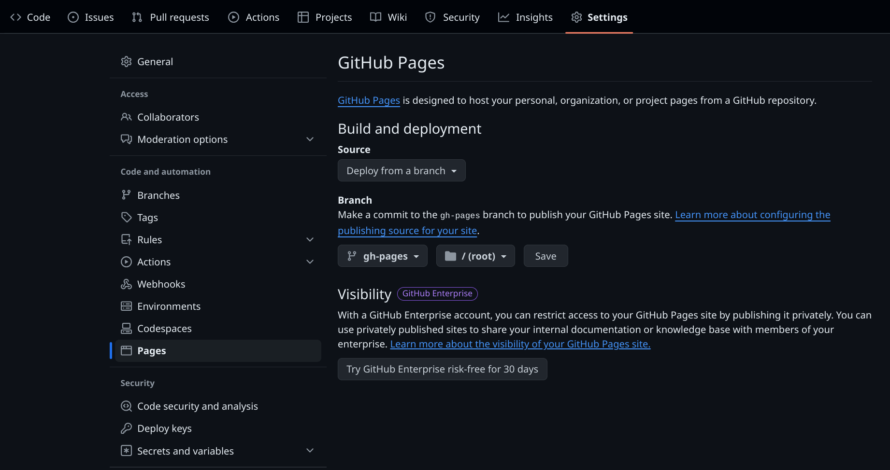

# ChillFeed

[](https://github.com/chillfeed/chillfeed/actions/workflows/fetch_feeds.yml)

ChillFeed is a relaxed feed aggregator that brings your feeds together in one place, with no pressure to keep up. It's designed for those who want a list of cool stuff so they can read what grabs their interest rather than a checklist of items that must be acknowledged.

**Demo:** https://chillfeed.github.io/chillfeed


## Features

- Aggregates multiple RSS, Atom, and JSON feeds
- Updates on a schedule via GitHub Actions
- Served via GitHub Pages
- No read/unread tracking - browse at your leisure
- **Not a reader** - opens articles on the source site, as the author intended

## Setup

1. [Use this template](https://github.com/new?template_name=chillfeed&template_owner=chillfeed) to create your own ChillFeed repo.
2. Enable [GitHub Pages](https://pages.github.com/) in your repo, selecting to deploy from the `gh-pages` branch. Be sure to click Save!

3. *(Optional)* If you want to serve ChillFeed on a custom domain instead of at `https://<username>.github.io/<repo>`, set the repository secret `CNAME` to the desired domain and be sure that's [configured appropriately](https://docs.github.com/en/pages/configuring-a-custom-domain-for-your-github-pages-site) with your DNS provider.
4. Copy `config.yaml.example` to `config.yaml` and edit it to define your feeds:
```yaml
articlesPerPage: 20                           # how many posts to show on each page
fetchWeeks: 4                                 # how many weeks to go back
feeds:
  - url: https://runtimeterror.dev/feed.xml
    title: jbowdre's Technical Blog           # override this title
  - url: http://blog.jbowdre.lol/feed/
    title: jbowdre's Weblog
```
5. Edit `.github/workflows/fetch_feeds.yaml` to set your preferred schedule.
```yaml
on:
  push:
    branches:
      - main
  schedule:
    - cron: '0 */4 * * *'  # Run every 4 hours
  workflow_dispatch:  # Allow manual trigger
```
6. Commit and push 🤞.

That will trigger the `.github/workflows/fetch_feeds.yml` workflow to fetch your configured feeds, and that will commit them as JSON files to the `gh-pages` branch. *That* commit will in turn trigger the default `pages-build-deployment` workflow to build your site. After a few minutes, you'll be able to see your feeds at `https://<username>.github.io/<repo>` or `https://<your_configured_domain>` if you configured a CNAME in step 3.

## Updating Your Repository

To update your ChillFeed instance with the latest changes from the template repository:
1. In your personal repo, add the template repo as a remote
```shell
git remote add template https://github.com/chillfeed/chillfeed.git
```
2. Fetch and merge the changes
```shell
git fetch template
git checkout -b update-from-template
git merge template/main --allow-unrelated-histories
```
3. Resolve any merge conflicts, paying special attention to any files you've modified
4. Commit the merged changes (if needed, following conflict resolution)
```shell
git add .
git commit -m "Merge updates from template repository"
```
5. Push the merged changes and create a pull request on GitHub
```shell
git push origin update-from-template
```
6. Review the changes in the pull request, merge it, and delete the update branch
```shell
git checkout main
git pull
git branch -d update-from-template
```

